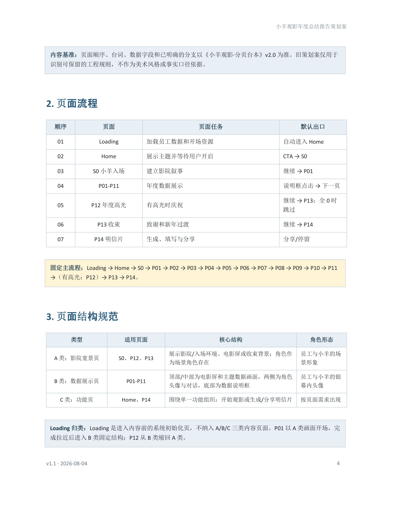
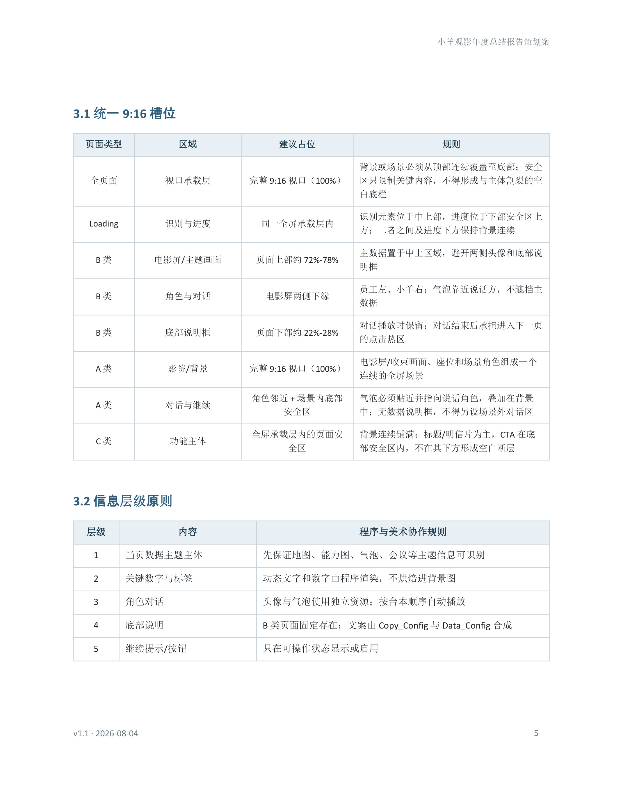
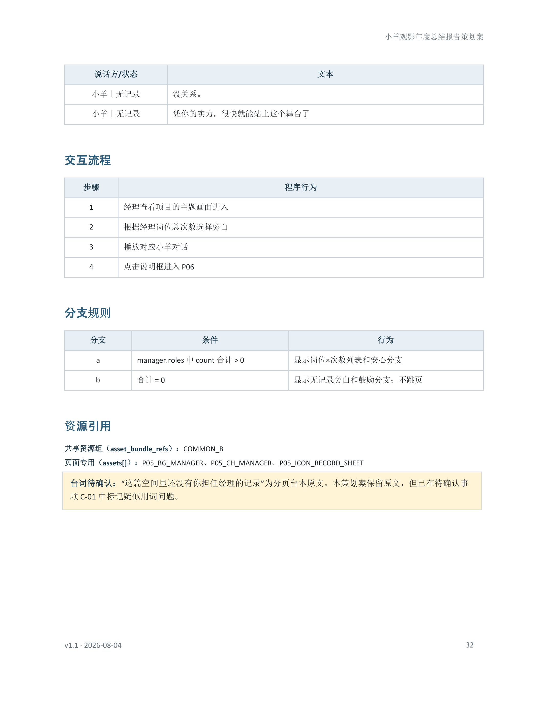
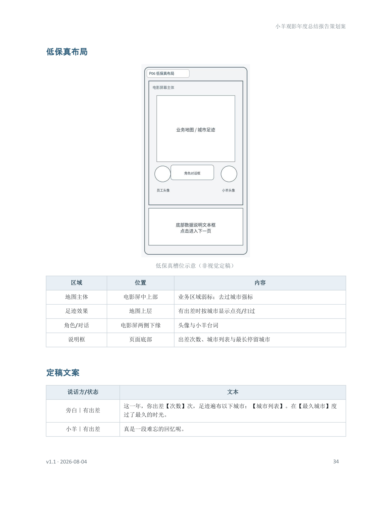
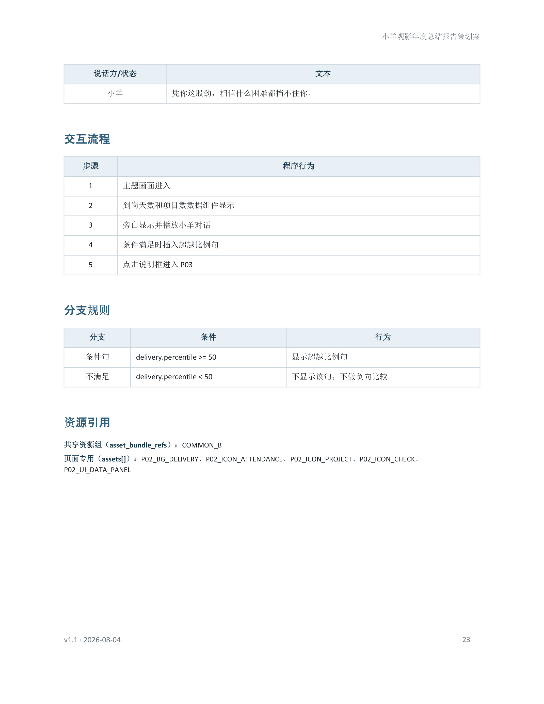
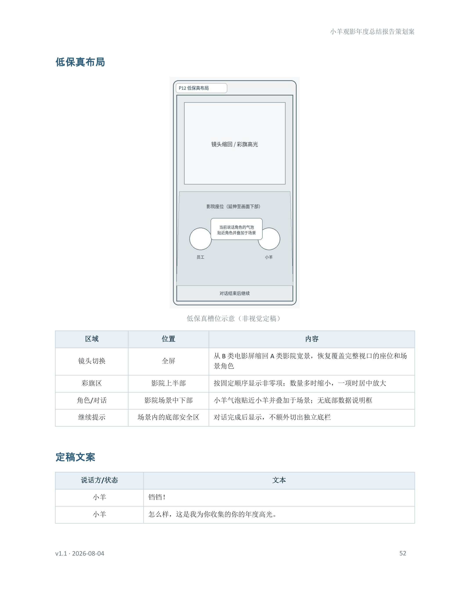
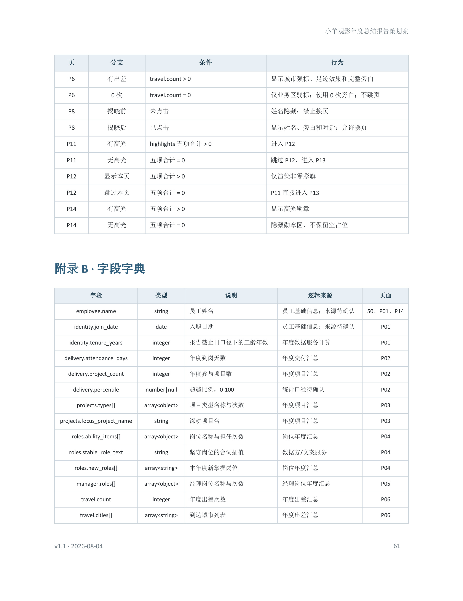

# 年度报告 H5 · 工作过程总结

| 项 | 内容 |
|---|---|
| 项目 | 英雄电竞 · 交付部门 · 2026 员工个人年度总结 H5 |
| 角色 | 综合运营实习生｜负责产品定位、信息结构、数据与分支口径，以及三版完整方案的设计与交付 |
| 时间 | 2026.05 – 2026.08 |
| 文档性质 | 公开总结；不含真实员工明细与完整内部台本 |
| 本文重点 | 从数据选型、特殊情况规则到三版方案；重点写第二版叙事演进、体验收敛与 AI 协作方式 |

---

## 1. 项目目标与约束

**需求：** 制作员工个人年度总结报告 H5；与公司级报告形成区分并体现个人特色；提交多版方案供选型。

**体验定位：** 面向员工个人，围绕交付与协作数据组织阅读体验；语气以鼓励、认可为主，避免考核压迫与无必要横向比较。

- 载体：竖屏 9:16 H5。
- 数据：业务底稿 + 部分飞书字段。公开材料不写真实姓名、业绩、地域等明细。

### 交付结果

本阶段主体工作是**策划设计与文档交付**：

- 完成三版完整体验方案的设计与交付，选型结果为第二版《与小羊的年度报告观影》。  
- 围绕入选方案沉淀可交接材料：完整策划案、字段与资源对照（页面位置—字段名—数据接口、美术资源命名）、美术需求表。

选型后曾补充尝试用 AI 辅助验证独立网页（含直接生成网页，以及 AI 素材 + Unity 搭建），实习期内未形成可独立交付的网页成品；该部分仅为落地验证，不作为本总结的主体成果。

---

## 2. 数据选型：如何概括员工的一年

在设计三版体验方案之前，先敲定共用数据口径。口径按以下步骤确定：

1. **全量归类**：先把可获得的飞书及相关业务字段按工作含义归类（投入、项目、岗位、外勤、协作、沟通、文档、会议等）。  
2. **去重与过滤**：剔除重复、语义相近以及与个人年度评价无关的类别，避免同义信息反复上屏。  
3. **类内选代表**：每一类只保留最能代表该维度的字段；同时补充具有记忆点的综合指标（如年度 CP、非普适高光等）。  
4. **可抓取确认**：就候选字段向运营侧确认能否抓取及抓取难度，难度过高或无法稳定产出的项不纳入正式口径。  
5. **维度收束**：将可落地的代表字段整合为若干评价维度，确认其能够较完整地覆盖员工一年的主要工作面后，再敲定最终数据口径，供三版方案共用。

最终维度与代表字段如下：

| 维度 | 代表字段 | 选型意图 |
|---|---|---|
| 身份 | 姓名、加入公司年限 | 开场锚点：先确认「你是谁、在场多久」 |
| 交付投入 | 累计上岗天数、参与项目数；条件展示项目覆盖超越比例 | 用在场天数与项目广度刻画工作量；横向比较仅作额外表彰，不作普适排名 |
| 项目构成 | 接手游戏类型及次数 | 展示年度项目成分，用构成关系代替广度攀比 |
| 岗位与方向 | 仍坚守岗位、新担任岗位 | 呈现职责纵深与拓展；经理职责另页单独突出 |
| 担任经理 | 经理岗位及次数 | 部门重要角色与奋斗目标，单独成页强调担当 |
| 外场与旅程 | 出差次数、城市列表、停留最久城市 | 把一年中最可感的奔赴落成足迹坐标 |
| 协作 | 共事最多同事（年度 CP） | 承袭往年口径；运营鼓励并肩协作，业务上也高频碰面，故「共事最多」具记忆点与代表性 |
| 沟通 / 文档 / 会议 | 消息量与常用表情、云文档与浏览、参会与组织侧发起 | 补齐日常协作与产出侧的工作量与方式特征 |
| 年度之最 | 在线时长最长月及其消息、会议、在线时长 | 把全年高峰压成一个可记忆的瞬间 |
| 非普适高光 | 评价、绩效月榜上榜/登顶、红榜、分享会等 | 少量人拥有的嘉奖数据，不塞进普适页，单独作额外表彰 |

高光口径说明：所选高光项合计覆盖约半数员工，使「被额外看见」有一定覆盖面，同时仍保持非人人皆有的稀缺感（例如绩效月榜若按前 10 外推覆盖过高，则收紧为更符合非普适定位的口径）。

---

## 3. 特殊数据情况处理

部分字段在人数覆盖、角色稀缺性或页面形态上存在差异。设计时按数据敏感原则预判边缘态，并规定显示 / 换文案 / 跳过等行为，使鼓励口径在特殊数据下仍然成立。（页码以入选方案屏序标注，便于对照交付文档。）

| 页 | 条件 | 为何定这个条件 | 不满足时 | 为何这样处理 |
|---|---|---|---|---|
| P02 交付 | 超越比例 ≥50% | 超越比例用于「额外表彰」积极投入的同事；30%、40% 等低分位不具备表彰意味，甚至易产生反效果 | 不显示该句；到岗与项目数照常展示 | 本报告传播以结尾明信片为主，单页截图外传弱；省略比较句通常不会造成「别人多一段、我少一段」的相对剥夺感 |
| P05 经理 | 经理次数合计 >0 | 经理是部门重要角色，也是一线员工可追求的奋斗目标；有记录时应单独表彰 | 保留本页，改用鼓励文案，不跳页 | 希望经理页成为固定章节：有则表彰担当，无则鼓励进取，避免因跳页打断「岗位成长」叙事 |
| P06 外场 | 出差次数 >0 | 出差是一年中高度可感的经历，适合用地图把足迹可视化并唤起回忆 | 保留地图，标记其所在位置，改用 0 次文案，不跳页 | 无出差不等于无外场叙事；跳过会造成章节缺失。保留地图与位置表达，用文案区分状态即可 |
| P12 高光 | 五项合计 >0 | 高光是给表现突出者的单独表彰页；所选数据合计约覆盖半数员工，使多数人仍有机会获得「被表扬」的惊喜 | 整页跳过，由 P11 进入 P13 | 该页本质是庆祝向场景过场，而非与交付、岗位同类的独立数据章；无高光时跳过，对整体观看节奏影响较小 |

---

## 4. 三版方案

数据口径与特殊情况规则确定后，再完成三种完整体验方案供选型：

| 方案 | 一句话 | 结果 |
|---|---|---|
| 纯数据展示 | 白底线框翻页，数字高亮 + 短叙述 | 完整交付，未入选 |
| 《与小羊的年度报告观影》 | 影院叙事 + 轻点击 | **完整交付，最终入选；本文展开** |
| 多交互小游戏 | 赛台闯关包装 | 完整交付，未入选 |

共同前提：第 2 节数据口径与信息主题一致；差异在体验组织与交互方式。

---

## 5. 第二版《与小羊的年度报告观影》

### 5.1 一句话体验

员工进入电影院，与「小羊」一同观看银幕中的个人年度工作故事，并在结尾生成可分享的年度明信片。

### 5.2 主流程

```text
Loading → Home → S0（小羊入场）
  → P01–P11（身份 / 交付 / 项目 / 岗位 / 经理 / 外场 / 沟通 / 年度CP / 文档 / 会议 / 年度之最）
  → P12 年度高光（五项全 0 则跳过）
  → P13 致谢收束
  → P14 小羊明信片
```

| 阶段 | 页面 | 体验任务 |
|---|---|---|
| 开场 | Loading、Home、S0 | 完成加载，建立观影概念，由小羊引入 |
| 数据故事 | P01–P11 | 按固定顺序呈现身份、交付与协作信息 |
| 庆祝与收束 | P12–P13 | 有高光则集中庆祝，再完成情绪收束 |
| 留念 | P14 | 生成仅含年度摘要的可分享明信片 |

### 5.3 页面结构

数据页统一为：**场景 + 角色 + 对话**。  
关键内容由场景内数据表现与角色对话承载，点击推进。

| 类型 | 适用 | 结构要点 |
|---|---|---|
| 影院 / 场景页 | S0、P12、P13 等 | 全屏场景；角色以场景形象参与叙事 |
| 数据页 | P01–P11 | 主题场景 + 角色 + 对话；数据呈现在场景内 |
| 功能页 | Home、P14 | 开始观影 / 生成并分享明信片 |

补充：Loading 为初始化页。P01 可由入场场景过渡到数据页；P12 在有高光时回到庆祝场景。

### 5.4 创意表现

同一套字段（见第 2 节），第二版用场景化表达降低「报表感」，让数字更容易唤起回忆：

| 表现 | 对应页 / 数据 | 设计意图 |
|---|---|---|
| 岗位雷达图 | 岗位与方向 | 把「仍坚守 / 新担任」等多维职责收成一张轮廓图，一眼看到纵深与拓展，而不是岗位名词列表 |
| 外场出勤地图 | 外场与旅程 | 用地图点亮城市与轨迹，把一年中的奔赴落成空间记忆，唤起「我去过哪里」的体感 |
| 项目构成表达 | 今年接手的项目 | 以类型构成（如泡泡大小对应次数）呈现成分，不做类型广度的同事比较 |
| 高光庆祝场景 | 年度高光 | 有高光时以影院庆祝场景集中呈现，强化「被看见」的仪式感 |
| 年度 CP 揭晓 | 共事最多同事 | 固定主流程页；点击揭晓共事最多的同事，形成互动记忆点 |

### 5.5 字段与资源对照

为便于后续开发对接，将页面需求拆分为：

| 类型 | 内容 |
|---|---|
| 页面配置 | 页面顺序、构图、状态、分支与引用关系 |
| 数据字段 | 各展示位置对应字段，及字段对应的数据接口 |
| 文案配置 | 角色对话与分支文案 |
| 美术资源 | 美术资源命名 / 资源 ID，及其用途与所属页面 |

原则：开发按字段与资源名对接；姓名、数字、城市等动态内容不写入美术图。

### 5.6 文档职责边界

策划案覆盖：流程、数据逻辑、交互、字段对照、低保真槽位。  
不覆盖：最终画风、配色、渲染工艺；未确认的探索素材不升格为硬性规范。

美术需求表说明：所需素材、使用位置与资源命名。视觉风格通过样张确认，不与规则层绑定。

---

## 6. 第二版方案演进

本节只写第二版内部真实发生过的方向调整：有问题、有判断、有落地结果；不把数据口径或文档整理包装成「迭代」。

### 6.1 叙事主题：四轮载体试错

第二版始终要解决同一件事：在**数据口径不变**的前提下，做出与第一版「直观读数」明显不同的沉浸体验。载体试过四轮，每一轮都按员工感受与制作可行性做取舍。

| 轮次 | 方向 | 为何废弃 / 为何留下 |
|---|---|---|
| 1 | 展览馆：同序数据套展区主题与展签旁白 | 空间包装在，代入感弱；读起来仍像换了皮肤的数据翻页，与第一版差异不够 |
| 2 | 写实公司参观：工位、闸机等真实工作场景 + 小羊带路 | 把「回顾一年」做成「再走一遍上班动线」，情绪容易发闷；部门内外勤多、常不在司，公司场景对很多人也不具代表性 |
| 3 | 抽象内心场景：心象分章、象征景观 | 单页场景创意与制作成本都偏高；画面一抽象，又与日常工作疏远，温度接不上 |
| 4 | **影院观影（入选）**：入场观影，银幕播放经风格化处理后的工作画面，吉祥物小羊陪看 | 见下 |

**入选判断（影院）：**  
工作内容仍来自真实年度数据，但不再还原工位或心象迷宫，而是把投入、外场、协作等片段**改写成银幕上的一幕幕短片**；员工与小羊并肩观看，而不是被带回办公现场。这样既保留「这是我的一年」的实感，又带仪式感与陪伴感；场景类型收敛后，美术与制作成本也比写实动线、抽象心象更可控。

贯穿几轮未丢的部分：小羊作为对话伙伴、鼓励向语气、以及「先定数据壳再换叙事核」——第二、三版仍复用第一版信息结构与字段规则，只替换体验载体，再扩成完整策划案。

### 6.2 落地验证（补充）

设计交付为主；选型后曾用可点网页与 Unity 做流程与观感验证，实习期内未形成可独立交付成品。

---

## 7. AI 协作

本项目是深度 AI 协作下的策划交付：AI 提速草稿与探索，**口径、取舍与是否写入正式规范由人工确认**。协作方式随阶段变化，而不是「一次性生成定稿」。

### 7.1 分工

| 人工负责 | AI 承担 |
|---|---|
| 体验目标、语气边界、数据口径与特殊情况规则 | 按已定结构扩写策划案表格、整理对照清单 |
| 分页台本与关键交互判断 | 生成线框说明、检查清单与演示骨架草稿 |
| 哪些探索可进正式规范 | 多风格样张、角色/场景候选、提示词试验 |
| 验收：是否像「读报告 / 观影」、数字是否可读 | 生成线框、样张或网页原型供对比 |

### 7.2 实际怎么用

**文档与结构**  
先由人工定数据口径、台本与页结构，再用 Cursor 等工具按第一版体例批量填充第二版策划案，再人工删套话、补分支、处理与台本的冲突。第二、三版也采用「改核心思路 → AI 按同一骨架生成 → 人工定稿」的方式控成本。

**视觉探索**  
整理 Midjourney / 即梦等提示词包与分镜说明，用来试小羊角色与影院场景方向；需要给上级看结构时，另出线框核对版，避免「看图猜场景」。构图与资源命名先由人工锁定，再按需求表推进样张。

**原型验证**  
曾用 AI 辅助生成可点网页，并以策划案、美术资源需求表约束输出；后续也用 Unity 做流程与表现的可控验证。该线未在实习期内完成成品，不改变「设计交付为主」的结论。

### 7.3 边界

- AI 产出一律当草稿；进正式策划案前过口径、台本与分支检查。  
- 不把具体模型名或 Prompt 写成开发硬性依赖；交接物是字段、资源名与状态规则。  
- 关键数据缺失走重试 / 既定特殊情况规则，不以样例值或生成值冒充真数据。

---

## 8. 证据摘录

来源：第二版终版策划案（《小羊观影年度总结报告策划案》）页码截图。公开总结只摘结构与规则页，不含员工明细。

<div class="figure">



<p class="figcap"><strong>摘录：</strong>主流程 Loading→P14　｜　<strong>说明：</strong>固定观影路径与高光可选页</p>
</div>

<div class="figure">



<p class="figcap"><strong>摘录：</strong>A/B/C 三类页面结构　｜　<strong>说明：</strong>影院宽景 / 数据展示 / 功能页分工</p>
</div>

<div class="figure">



<p class="figcap"><strong>摘录：</strong>P05 经理　｜　<strong>说明：</strong>无记录仍留页，改鼓励文案</p>
</div>

<div class="figure">



<p class="figcap"><strong>摘录：</strong>P06 外场　｜　<strong>说明：</strong>地图足迹表达与低保真槽位</p>
</div>

<div class="figure">



<p class="figcap"><strong>摘录：</strong>P02 交付　｜　<strong>说明：</strong>超越比例条件展示</p>
</div>

<div class="figure">



<p class="figcap"><strong>摘录：</strong>P12 高光　｜　<strong>说明：</strong>庆祝向场景与非零项呈现</p>
</div>

<div class="figure">



<p class="figcap"><strong>摘录：</strong>分支规则汇总　｜　<strong>说明：</strong>特殊数据条件与行为对照</p>
</div>
