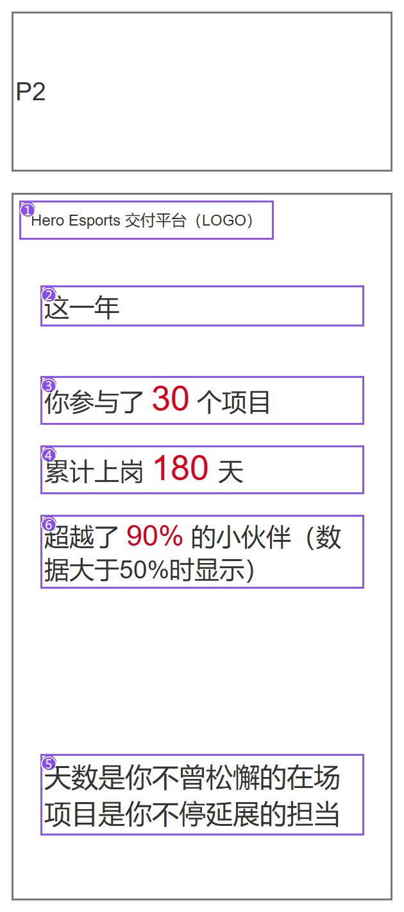
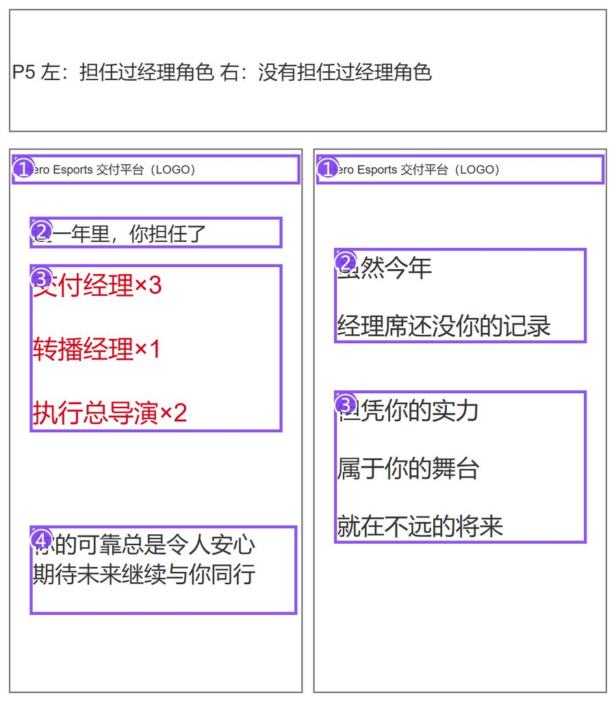
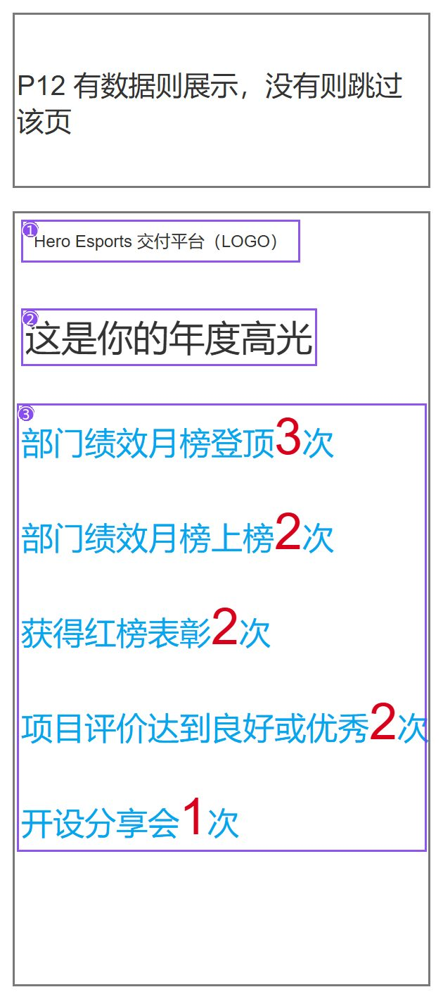

# 年度报告 H5 · 运营与迭代

| 项 | 内容 |
|---|---|
| 项目 | 英雄电竞 · 交付部门 · 2026 员工个人年度总结 H5 |
| 角色 | 综合运营实习生｜负责产品定位、信息结构、数据与分支口径、三版选型，以及第二版执行文档与原型协作 |
| 时间 | 2026.05 – 至今 |
| 文档性质 | 公开总结；不含真实员工明细与完整内部台本 |
| 本文重点 | 第二版「小羊观影」：我怎么迭代、怎么和 AI 协作；三版只作选型背景 |

可点原型：https://sheep-cinema-annual-report.blush-nova-6933.chatgpt.site/  
（ChatGPT Site，访问需登录。）

正式执行文档（本地）：《小羊观影年度总结报告策划案 v1.1》《小羊观影年度总结报告美术资源需求表 v1.1》（2026-08-04；内容基准为《小羊观影·分页台本》v2.0）。

---

## 1. 项目目标与约束

部门要做一份员工个人年度总结 H5：用交付和协作数据，让人感到这一年被看见。上级要求并行看到多套完整想法再选型，而不是只改语气的一版。

- 目标：把个人年度数据组织成可浏览、可互动、可分享的故事。
- 载体：竖屏 9:16 H5。
- 语气：鼓励、认可；不做考核压迫，不做无必要横向攀比。
- 数据：业务底稿 + 部分飞书字段。公开材料不写真实姓名、业绩、地域等明细。
- 阶段：口径已冻结，三版已选型，第二版 v1.1 执行文档与可点原型已完成；正式开发上线尚未开始。

---

## 2. 三版方案（选型背景）

我先冻结数据口径和信息主题，再并行三种读法：

| 方案 | 一句话 | 结果 |
|---|---|---|
| 纯数据展示 | 白底线框翻页，数字高亮 + 短叙述 | 未作为主推展开 |
| 小羊观影 | 影院叙事 + 轻点击 | **本文展开** |
| 多交互小游戏 | 赛台闯关包装 | 未进入后续评审；完整策划案未留存 |

选型原则：口径先定，表现层可换。

---

## 3. 第二版是什么（以 v1.1 为准）

第二版正式名：**小羊观影 · 部门年度总结报告**。

### 3.1 一句话体验

员工进入电影院，与「小羊」一起观看银幕上播放的个人年度工作故事，最后生成可分享的年度明信片。

### 3.2 主流程

```text
Loading → Home → S0（小羊入场）
  → P01–P11（身份 / 交付 / 项目 / 岗位 / 经理 / 外场 / 沟通 / 年度CP / 文档 / 会议 / 年度之最）
  → P12 年度高光（五项全 0 则跳过）
  → P13 致谢收束
  → P14 小羊明信片
```

| 阶段 | 页面 | 体验任务 |
|---|---|---|
| 开场 | Loading、Home、S0 | 加载、建立观影概念、小羊带入场 |
| 数据故事 | P01–P11 | 按固定顺序讲身份、交付与协作 |
| 庆祝与收束 | P12–P13 | 有高光则庆祝，再用小羊台词收束 |
| 留念 | P14 | 生成只含年度摘要的可分享明信片 |

### 3.3 页面结构 A / B / C

| 类型 | 适用 | 结构要点 |
|---|---|---|
| A 影院宽景 | S0、P12、P13 | 全屏影院/收束场景；角色是场景形象 |
| B 数据展示 | P01–P11 | 银幕主题画面 + 两侧头像对话 + 底部说明框 |
| C 功能页 | Home、P14 | 开始观影 / 生成分享明信片 |

例外：Loading 只做初始化，不入 A/B/C。P01 以 A 开场，拉近后进 B；P12 从 B 缩回 A。

### 3.4 配置拆分

| 配置 | 管什么 |
|---|---|
| Page_Config | 页面顺序、构图、状态、分支、引用 |
| Data_Config | 字段与展示值 |
| Copy_Config | 旁白、台词、分支文案 |
| Art_Config | 资源 ID → 文件 |

原则：程序不靠文件名猜用途；姓名、数字、城市等动态内容不写进美术图。

### 3.5 职责边界

v1.1 策划案管：流程、数据逻辑、交互、配置、低保真槽位。  
不管：画风、配色、渲染方式、AI 绘图工具/Prompt、最终视觉定稿。

配套美术资源需求表只回答「要什么素材、用在哪、资源 ID 是什么」，同样不锁画风。  
早期探索 Demo 的某一套画面，只证明结构可跑通，**不等于 v1.1 已锁定的最终美术**。

### 3.6 关键分支

| 页 | 条件 | 满足 | 不满足 |
|---|---|---|---|
| P02 交付 | 超越比例 ≥50% | 显示比较句 | 整句不出现，不做负向比较 |
| P05 经理 | 经理次数合计 >0 | 列岗位×次数 | 保留本页给鼓励文案，不跳页 |
| P06 外场 | 出差次数 >0 | 完整足迹表达 | 0 次分支，不跳页 |
| P08 年度 CP | 已点击揭晓 | 显示姓名并允许换页 | 姓名隐藏，禁止换页 |
| P12 高光 | 五项合计 >0 | 只渲染非零项 | 整页跳过，P11 直达 P13 |

---

## 4. 我怎么迭代

### 4.1 迭代主线

| 阶段 | 当时的问题 | 我的判断 | 我改了什么 |
|---|---|---|---|
| 选型 | 上级要多套完整想法 | 先冻口径，再换读法 | 并行三版；后文只深挖小羊观影 |
| 叙事 | 探索期容易把风格、镜头、文案缠在一起 | 第二版要对齐的是规则与读法 | 收敛为影院叙事；把数字可读写成信息层级 |
| 工程化 | 口头方案程序接不住 | 文档必须能直接对接 | 拆 Page/Data/Copy/Art；出资源 ID 需求表 |
| 分支 | 经理 0 次、出差 0 次、无高光等边缘态 | 边缘态也要有明确行为 | 写入台本与 v1.1 分支表 |
| 原型 | 只看文档难判断节拍和点击 | 关键路径要能点一遍 | 用 AI 搭可点原型，走通主流程 |

### 4.2 一次具体迭代：把「好看」和「可执行」拆开

| 步骤 | 内容 |
|---|---|
| 原状态 | 探索阶段风格、文案、交互混在一起评审，很难判断错在哪一层 |
| 问题 | AI 出图和临时 Demo 容易被误当成正式规范 |
| 判断 | 策划案应冻结流程与口径；风格必须可替换 |
| 修改 | v1.1 切开职责：策划案管规则；美术表只管资源 ID 与分层；风格留给样张 |
| 落点 | 写入策划案「负责 / 不负责」表，以及美术表「不锁画风」说明 |
| 未验证 | 最终视觉样张与正式资产生产闭环 |

规则类证据（早期线框，证明分支思考，非正式视觉）：

<div class="figure">



<p class="figcap"><strong>页面类型：</strong>交付投入规则示意　｜　<strong>证明内容：</strong>超越比例条件句　｜　<strong>当前状态：</strong>早期线框</p>
</div>

<div class="figure">



<p class="figcap"><strong>页面类型：</strong>经理页双态示意　｜　<strong>证明内容：</strong>无记录仍留页　｜　<strong>当前状态：</strong>早期线框，与 v1.1 P05 一致</p>
</div>

<div class="figure">



<p class="figcap"><strong>页面类型：</strong>高光条件示意　｜　<strong>证明内容：</strong>全无则跳过　｜　<strong>当前状态：</strong>早期线框，与 v1.1 P12 一致</p>
</div>

---

## 5. AI 协作

我把 AI 当加速器，不把模型输出直接当成定稿。

### 5.1 分工

| 我拍板 / 验收 | AI 辅助 |
|---|---|
| 目标、禁区语气、数据口径、分支 | 按既有结构扩写文档、整理表格 |
| 页面流程、A/B/C、交互状态 | 生成低保真槽位说明和检查清单草稿 |
| 配置字段、资源 ID、文档边界 | 按需求表起草资源清单与命名建议 |
| 样张是否升格进正式规范 | 生成探索向美术候选 |
| 原型是否覆盖主路径与关键点击 | 搭建可点原型、加快页面串联 |

### 5.2 三个用法

**写文档**  
先给定口径和页结构，让模型按「目标—数据—布局—文案—交互—分支—资源」填表；我再删套话、补分支、改冲突。  
反例：模型爱写空泛收束句、反复「这一年」。我加了禁区和频次限制，最终以台本 / v1.1 为准。

**美术探索**  
用 AI 快速出背景、角色、UI 底板，验证「影院叙事是否成立」。  
同时在美术需求表写明：动态文字不进图、按资源 ID 交付、画风不由策划案锁死。避免把偶然出图写成硬约束。

**搭原型**  
把主流程和关键交互落到可点原型，用来检查 Loading→明信片、P08 必须揭晓、P12 可跳过等路径。  
原型地址：https://sheep-cinema-annual-report.blush-nova-6933.chatgpt.site/

### 5.3 边界

- AI 产出默认是草稿，进正式文档前必须过口径和分支检查。
- 不把 AI 工具、模型、Prompt 写成策划案硬性要求。
- 关键数据缺失时走重试，不用样例值或模型编造值顶替。

这些边界已经写进 v1.1 的「负责 / 不负责」。

---

## 6. 证据与材料

| 材料 | 位置 | 说明 |
|---|---|---|
| 策划案 v1.1 | 本地 | 流程、交互、配置、低保真、验收 |
| 美术资源需求表 v1.1 | 本地 | 资源 ID、分层、验收 |
| 可点原型 | 上方链接 | ChatGPT Site |
| 早期探索截图 | 仓库 `证据/` | 证明结构曾跑通，非正式视觉定稿 |

探索期 Demo 连续帧（示意数据）：

<div class="figure">


<p class="figcap"><strong>页面类型：</strong>探索原型 · 数据页　｜　<strong>证明内容：</strong>数据 + 对话 + 旁白　｜　<strong>当前状态：</strong>探索 Demo</p>
</div>

<div class="figure">


<p class="figcap"><strong>页面类型：</strong>探索原型 · 高光页　｜　<strong>证明内容：</strong>影院壳 + 高光列表　｜　<strong>当前状态：</strong>探索 Demo</p>
</div>

<div class="figure">


<p class="figcap"><strong>页面类型：</strong>探索原型 · 明信片　｜　<strong>证明内容：</strong>摘要卡 / 分享　｜　<strong>当前状态：</strong>探索 Demo</p>
</div>

---

## 7. 已完成 / 未验证

| 已完成 | 未完成 / 未验证 |
|---|---|
| 三版选型与口径冻结 | 正式开发上线与真数据埋点 |
| 第二版 v1.1 执行文档（策划 + 美术需求） | 视觉样张最终锁定与资产生产闭环 |
| 分支表、配置拆分、资源 ID 体系 | 多机型真机验收 |
| AI 辅助文档 / 探索资产 / 可点原型 | 上线后打开率、完成率、分享率 |

仍未验证：真数据下 P12 跳过率；演出是否削弱数字可读。
