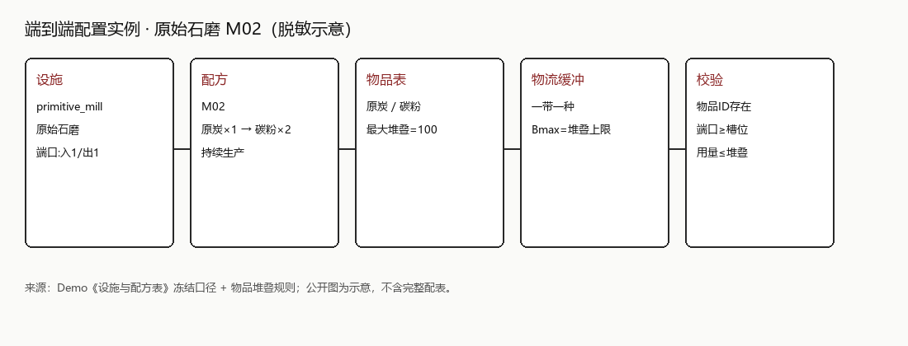

# 《灵域天空岛》系统设计：生产 · 物流 · 存储

| 项 | 内容 |
|---|---|
| 项目 | 2D 沙盒自动化 · 团队项目 |
| 角色 | 策划负责人 |
| 时间 | 2025.09 – 至今 |
| 说明 | 公开精炼版；不是完整内部 GDD |

---

## 1. 专题定位

通路**不设独立额定产能 / 带速养成**，降低自动化上手门槛，把主决策从「玩传送带」转到设备本身：

- 放哪些设施、放在哪里、如何连线；  
- 放几台、是否升级；  
- 进一步通过**客制化**做出更贴合布局的专项设备，提高摆放自由度。

畅通时，运输表现跟随上下游端口能力；失配时用反压把堵塞读出来。策略重心是设备选型、数量、摆放与产能匹配。

建造环里，物品在节点上发生的事情不同，因此按语义拆成三个系统，再写端口、停工、异常与配置校验：

- **生产**：转换物品（执行配方）  
- **物流**：搬运物品（种类不变）  
- **存储**：保管 / 转发（不转换）

一句话定界：生产负责变，物流负责搬，存储负责放。

```text
采集 / 加工设施 ──产出──▶ 物流通路（单格缓冲）──▶ 下游设施 / 容器
         ▲ 反压停工 ◀── 缓冲满 / 下游拒收
```

---

## 2. 系统边界与玩家决策

| | 生产 | 物流 | 存储 |
|---|---|---|---|
| 核心职责 | 转换物品 | 搬运物品 | 保管 / 转发 |
| 玩家决策点 | 设施与配方、持续 / 指定、客制化 | 设备落位与连通、台数与升级、读反压并调控 | 库存整理、筛选、仓库节点 |
| 口容量口径 | 输入口 = 当前配方该槽单次用量 | 缓冲上限 = 物品单格堆叠上限 | 堆叠格；接带后仍不转化 |

端口形态统一，接受规则由所属系统叠加；同类设施共用 UI，差异进配置。

---

## 3. 生产：统一转换骨架

所有生产设施共用配方、端口、时序、停工逻辑。

- 前期近身手工，中后期产线持续做中间件，总装等用指定次数做成品——**同一套规则、两种用法**。  
- 输入口容量跟「当前配方该槽单次用量」走；未选配方则拒收。  
- 停工统一接：缺料、输出受阻、次数用尽等，并和物流反压对接。

### 3.1 改配方与退料（已定规则）

1. 同时只激活一条配方。  
2. 更换配方：当前单次制作立刻中止；口内原料退回相连通路缓冲。  
3. 若无法退净（通路满、种类冲突、无连接），**禁止完成换配方**，直到可退净或玩家手取走。  
4. 成功后按新配方重新锁定输入口。

---

## 4. 物流：透明连接与反压

### 4.1 规则摘要

通路由输出口拖到输入口生成；一带一种、单格缓冲；缓冲上限对齐存储单格堆叠上限；**不设独立额定产能**。

缓冲接近 / 顶满 → 通路变红；上游无法输出 → 设备红警告停工；玩家取出缓冲或下游恢复 → 自动恢复。

### 4.2 反压完整例子（熔炉 → 装配）

以「原始熔炉产出锭 → 通路 → 原始装配台输入」为例：

1. 下游装配台停止消耗（缺另一原料 / 指定次数用尽 / 玩家关掉）。  
2. 通路缓冲堆到堆叠上限。  
3. 熔炉输出口无法写入通路 → 熔炉进入输出受阻停工（红警告）。  
4. 若更上游还在向熔炉喂矿，输入侧也可能堆满，反压继续上传。  
5. 玩家可再摆 / 改接设备、分流到箱子、取出通路缓冲，或恢复装配台消耗。  
6. 缓冲下降后，熔炉自动解除停工并继续（若模式与次数仍允许）。

### 4.3 拆除与异常（已定 / 待验证）

| 情况 | 处理 | 状态 |
|---|---|---|
| 拆除通路且缓冲 &gt; 0 | 缓冲物掉落通路中点附近，或弹入背包（实现二选一，建议掉落） | 已约定，待程序验证 |
| 下游筛选拒收错误物品 | 不进入该口；通路保持锁定种类，缓冲可堆积并反压 | 已定口径 |
| 停工期间是否继续收货 | 生产侧：通常停止从物流继续接收；口内未达单次用量的料可保留 | 已定口径 |
| 精确分流比例 | 本版建议轮询 / 平均，细则后置 | 待验证 |

---

## 5. 存储：不转换前提

存储只保管与界面整理（选中、半选、交换等），不执行配方。接物流后端口仍不转化物品，容量按堆叠上限理解。多口仓库、跨界大型传送仓储属远期接口，不抢本专题正文。

---

## 6. 配置结构与校验证据

来源：内部配置表 + Demo 设施 / 配方冻结表。公开只保留字段关系与一条端到端实例。

### 6.1 关键字段关系

| 表 | 关键字段 | 作用 |
|---|---|---|
| 物品 | 物品ID、最大堆叠 | 物流缓冲上限来源 |
| 配方 | 材料 / 结果 ID 与数量、配方类型 | 生产转换定义 |
| 设施 | 设施ID、可接物流、允许的配方类型 | 设备与配方匹配 |

关联：`设施允许的配方类型` ↔ `配方.配方类型`；`配方材料/结果 ID` ↔ `物品.物品ID`；端口方向与配方输入输出槽位对应。

### 6.2 端到端实例（Demo 冻结表）

**`primitive_mill` · `M02`（`original_charcoal` → `carbon_dust`）**

| 环节 | 取值 | 来源 |
|---|---|---|
| 设施 ID | `primitive_mill`（原始石磨） | 设施表 |
| 可接物流 | 是（输入 + 输出） | 设施表 |
| 配方 ID | `M02` | 产线配方表 |
| 输入 / 输出 | 原炭 ×1 → 碳粉 ×2 | 配方表 → 物品表 |
| 端口 | 输入口 1 + 输出口 1；口容量 = 该槽单次用量 | 生产通用规则 |
| 缓冲 | 一带一种；Bmax = 最大堆叠 | 物流规则 + 物品表 |
| 校验 | 物品存在；端口覆盖槽位；单次用量 ≤ 堆叠 | 已人工核对该条 |



### 6.3 跨表校验（已定规则）

1. 配方输入输出物品 ID 必须能在物品表找到。  
2. 设施允许的配方类型须与配方所属类型一致。  
3. 端口数量、方向须能覆盖配方输入输出槽位。  
4. 单次用量不得大于对应物品最大堆叠；缓冲上限取最大堆叠。

全表自动化校验报告尚未形成。上层扩展（不抢主题）：科技树节点配置解锁；制作客制化走「主配方定产物 + 辅料影响性能」，服务更自由的设备摆放。

### 6.4 开发状态

| 类别 | 状态 |
|---|---|
| 已冻结规则 | 三系统边界；生产通用规则；物流通路与反压；存储不转换 |
| 已形成文档 | 《生产》《物流》《存储》相关策划案；游戏大纲；本公开案例 |
| 已形成配表 | 物品 / 配方等配置表；Demo 低阶设施与配方冻结 |
| 等待程序验证 | 反压连锁、拆除掉落二选一、筛选拒收、改配方退料边界 |
| 仍待填细则 | 各大类生产细表、存储接物流正文合并、精确分流比例等 |

相关可读：《系统策划作品集》《游戏大纲》。
