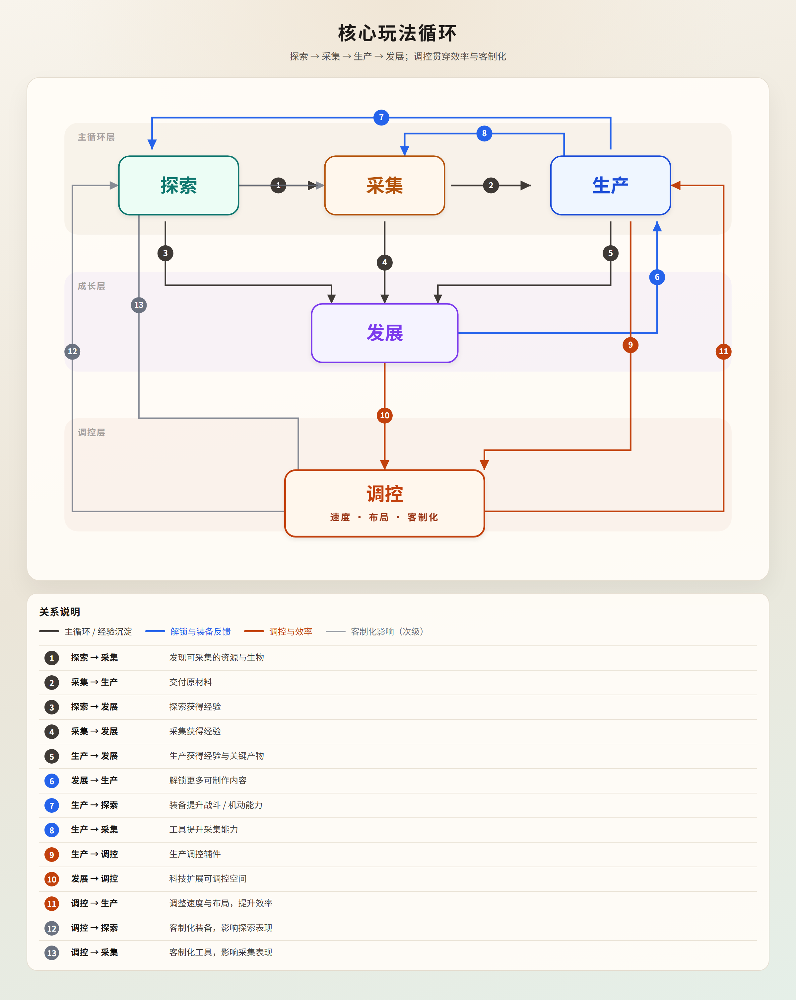
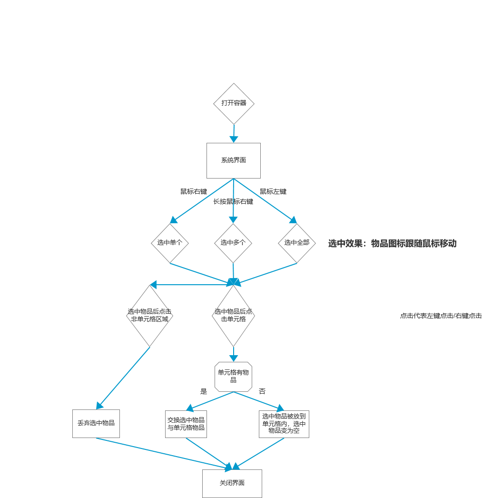

# 《灵域天空岛》系统策划作品集

**姓名：** 张梓涵  
**求职方向：** 系统策划  
**项目角色：** 同人爱好者独立游戏团队 · 策划负责人  
**项目周期：** 2025.09 – 2026.07  

> 本文摘录产线相关系统设计：系统如何划分与定界、模块如何联动，以及在传统沙盒与工业自动化基础上的创新点。完整项目另含探索、战斗、灵力、科技树等模块，此处只展开这一切片。

---

## 目录

1. [项目总览](#1-项目总览)
2. [定位与核心循环](#2-定位与核心循环)
3. [系统划分与边界](#3-系统划分与边界)
4. [系统联动设计](#4-系统联动设计)
5. [创新设计](#5-创新设计)
6. [落地规格摘要](#6-落地规格摘要)
7. [职责与产出](#7-职责与产出)

---

## 1. 项目总览

| 维度 | 说明 |
|------|------|
| 品类 | 2D 沙盒 · 工业自动化，延伸探索、建造与轻量 RPG |
| 暂定名 | 灵域天空岛 / 灵械天空岛 |
| 核心体验 | 破碎天空岛中，「探索—收集—建造—发展—调控」闭环；产线与灵力共同驱动补天 |
| 本文重点 | **系统划分与边界** · **模块联动** · **相对传统自动化 / 沙盒的创新** |

---

## 2. 定位与核心循环

### 2.1 定位

| 项 | 内容 |
|---|---|
| 类型 | 沙盒 · 工业自动化（2D） |
| 体验关键词 | 孤岛探索 · 资源驱动科技 · 产线自动化 · 灵力布局决策 · 阶段式世界推进 |
| 世界框架 | 四大界域；每界主岛 + 小岛；岛间虚空不可步行通行 |

### 2.2 核心玩法循环



五环互为输入输出：

1. **探索** — 发现岛屿、资源点与通行条件  
2. **收集** — 获取原料与关键进程资源  
3. **建造** — 落位产线单元、连通物流与灵力  
4. **发展** — 解锁科技、升级工具与通行能力  
5. **调控** — 监控瓶颈、优化布局与配方，再驱动下一轮探索  

与产线相关的口径：玩家行为本身不耗灵力；灵力由器械与产线运转消耗；建造环中的模块化产线，由生产与物流规则承接。

### 2.3 产业链骨架

```text
采集 / 采集类设备
  → 磨制、熔炼、反应、压制等中间加工（常持续生产）
  → 零件等中间件
  → 总装类设施（常指定数量）
  → 装备、可放置设备
```

---

## 3. 系统划分与边界

产线体验拆为三个并列系统：**生产、物流、存储**。划分依据不是界面外观，而是**物品在该节点上发生什么**。

### 3.1 划分原则

| 原则 | 含义 |
|------|------|
| 按物品语义切分 | 转换 / 搬运 / 保管 三种语义各成一系统 |
| 端口统一、职责分治 | 输入口 / 输出口逻辑形态一致，但接受规则由所属系统叠加 |
| 配置拉开差异 | 同类设施共用规则与 UI，等级与配方走配置表 |
| 边界先于细则 | 先冻结「谁负责什么」，再写各系统内部规则 |

### 3.2 三系统边界

| | 生产 | 物流 | 存储 |
|--|------|------|------|
| 核心职责 | **转换**物品（执行配方） | **搬运**物品（种类不变） | **保管 / 转发**物品（不转换） |
| 输入规则 | 选配方后一对一锁原料；容量 = 该槽**单次配方用量** | 上游写入通路缓冲 | 普通堆叠格；接物流后口容量 = 堆叠上限 |
| 输出规则 | 产物写入相连通路或口内 | 下游实时取走缓冲 | 可按筛选器向外发货 |
| 未选配方时 | 输入口拒绝一切输入 | 无配方概念 | 无配方概念 |
| 玩家决策点 | 设施选型、配方、持续 / 指定 | 布局连通、产能匹配、读反压 | 库存整理、筛选、仓库节点 |

一句话定界：

> **生产负责变，物流负责搬，存储负责放。**

### 3.3 生产内部再划分

生产系统内部按「大类」组织，而不是按单个建筑各写一套规则：

| 大类 | 名称 | 物流 | 定位 |
|------|------|------|------|
| P01 | 近身合成 | 否 | 前期工具 / 设备本体；材料来自背包 |
| P02 | 采集类 | 输出为主 | 场地 / 矿脉约束 |
| P03–P06 | 磨制 / 熔炼 / 反应 / 压制 | 是 | 中间加工 |
| P07 | 总装类 | 是 | 零件 → 装备 / 可放置设备 |
| P08–P13 | 培育 / 炼丹 / 提纯 / 能源 / 维护 / 古代工艺 | 视设计 | 五行分支与特殊工艺 |

同类多等级：**同一套 UI 与操作规则**；用配置区分速率、配方权限、端口数、灵力消耗与外观。

### 3.4 生产通用骨架（边界内规则）

在「转换」这一边界内，所有可接物流的生产设备共享：

- **配方锁定端口**：已选配方 → 口与原料一对一；未选 → 全拒收  
- **单次用量上限**：口内只缓存一次制作所需，不按堆叠上限囤料  
- **时序**：`T = 工作量 / 制作速率`；完成扣料并写产物  
- **双模式**：持续生产（中间件） / 指定次数（装备与设备）  
- **统一停工态**：输出堵塞、次数耗尽、缺料 / 灵力等共享红警告，解除条件分成因  
- **改配方**：中止当前单次并退料；无法退净则不允许切换  

---

## 4. 系统联动设计

边界划清之后，联动靠**共享端口语义 + 共享状态机 + 共享表现语言**完成。

### 4.1 联动总图

```text
存储（箱子 / 背包）
    │ 手塞 / 取出（同接受规则）
    ▼
生产输入口 ──配方转换──▶ 生产输出口
    ▲                         │
    │         物流通路（一带一种 + 单格缓冲）
    └──────── 反压 / 供料 ◀────┘
                    │
                    ▼
              下游生产 / 存储端口
```

### 4.2 生产 ↔ 物流

| 联动点 | 设计 |
|--------|------|
| 端口即端点 | 生产输入口 / 输出口是物流的主要连接对象 |
| 瞬时交接 | 设备与通路之间的写入 / 取走，规则上视为瞬时；时间瓶颈留在制作耗时 |
| 反压对接停工 | 通路缓冲顶满 → 上游无法输出 → 生产进入停工；缓冲下降后自动恢复（若模式仍允许） |
| 改配方退料 | 口内原料退回相连通路；通路满或种类冲突时禁止换配方，保证物品守恒 |
| 停工时收货 | 停工期间通常停止继续从物流收货，使反压能继续向上游传导 |

**反压链路：**

```text
B = Bmax（通路缓冲满）
  → 本段不再接收
  → 上游生产停工
  → 更上游取走变慢 → 其缓冲也可能顶满
  → 停工链向上游传导
```

### 4.3 物流 ↔ 存储

| 联动点 | 设计 |
|--------|------|
| 缓冲模型对齐存储直觉 | 一条通路 =「上游输出自动进入一个与箱子单格相同规则的缓冲，下游实时取走」 |
| 缓冲上限同源 | Bmax = 单个存储格对该物品的堆叠上限 |
| 手感一致 | 玩家可取出通路缓冲物；操作对齐存储的取出逻辑 |
| 容器接带 | 固定容器具备物流端口后，只做保管与转发，不发生转换 |
| 筛选协作 | 存储 / 端口筛选器与「一带一种」取交集，共同约束物资流 |

### 4.4 生产 ↔ 存储

| 联动点 | 设计 |
|--------|------|
| 手塞等同物流写入 | 手塞必须匹配当前配方绑定，且不超过「单次用量 − 已有」 |
| 职责不互相替代 | 大量库存放在存储；生产口只服务下一次制作 |
| 近身合成过渡 | 早期用背包驱动的近身合成制作设备本体，再接入产线，形成成长接力 |

### 4.5 表现层统一

| 状态 | 表现 |
|------|------|
| 通路缓冲接近 / 顶满 | 通路变红 |
| 因输出受阻停工 | 设备红警告 |
| 连接失败 | 提示文案 |

三系统共用同一套「红 = 堵塞 / 停工」语言，玩家读一条产线时不必切换三套心智模型。

### 4.6 向上接入更大循环

| 上层系统 | 与产线三联的接口 |
|----------|------------------|
| 灵力 | 大型生产设备运转耗灵力；选址与区域灵力浓度影响效率 |
| 科技树（无字书） | 解锁设施、配方、通行与分支能力 |
| 五行客制化 | 在生产配方上叠加辅料决策，进入「调控」环 |
| 跨岛物流（仙台） | 作为特殊物流节点接入网络，支撑分布式生产 |
| 探索 / 岛屿 | 岛类与灵力值决定资源禀赋，反向驱动产线布局与科技重心 |

---

## 5. 创新设计

本项目建立在「沙盒探索 + 工业自动化」之上，但并不复刻传统传送带工厂或纯生存建造。创新落在四条线上。

### 5.1 产能匹配优先，而非传送带养成

传统自动化常把「带子等级 / 带速」做成中期养成主轴。本项目将物流定义为：

- 通路**不设独立额定产能**  
- 畅通时不因传送带科技额外限速  
- 失配通过缓冲堆积与反压停工反馈  

玩家策略重心回到：**上下游速率是否匹配、布局是否合理**。物流学习成本贴近「会用箱子」，自动化深度留给产线结构本身。

### 5.2 持续 / 指定双模式，一套骨架服务两种需求

传统工厂模拟偏「无限流水」，传统沙盒合成偏「点一下做一件」。本项目用同一生产状态机覆盖两者：

| 模式 | 服务对象 |
|------|----------|
| 持续生产（默认） | 工业中间件、产线常规产出 |
| 指定生产（剩余次数 R） | 装备、可放置设备等有限件需求 |

工业产物与角色成长产物不再拆成两套互不相通的制作系统；总装类同样可接物流，端口规则与其它生产设备一致。

### 5.3 天空岛世界结构，重写自动化的空间前提

传统平面工厂默认「地块连续、步行可达」。本项目以破碎天空岛为空间前提：

- 岛间虚空不可步行；同界靠飞行器成长，跨界走遗迹传送规则  
- 仙台作为特殊物流节点，支持同界分布式生产  
- 岛屿灵力值定级，并按地形生态分配为**区域灵力浓度**，影响大型产线效率  
- 后期灵力输送覆盖选址决策：自动化不仅是拓扑问题，也是**能源地理**问题  

探索环与建造环因此真正咬合：找岛、选址、铺线、调灵力是同一套成长叙事。

### 5.4 五行客制化：把「调控」做成可研究的配方决策

在自动化「布局调控」之外，增加一层配方向调控：

| 要点 | 设计 |
|------|------|
| 结构 | 主配方定「造出什么」；辅料定「造得多好、偏什么方向」 |
| 材料模型 | 材料携带五行向量，连续影响成品性能维度 |
| 喧宾夺主阈值 | 辅料占比过高 → 主料构成改变 → 落入隐藏配方或失败 |
| 边际递减 | 极端性能越来越贵，推动提纯与纯料精调 |
| 相生相克 | 完全确定性反应，可研究、可复现 |
| 成长线 | 混料粗调 → 提纯 → 纯料精调 → 极端配料 / 附魔 |

五行科技分支（金木水火土 + 古代）同时提供不同配料来源与提纯能力；配方目标一旦确定，玩家需要为其建立主料 / 辅料 / 提纯材料的供应链——**产线规划与配方决策一体**。

### 5.5 创新对照小结

| 传统参照 | 本项目做法 |
|----------|------------|
| 传送带速率养成 | 通路无独立额定产能，策略在产能匹配与反压阅读 |
| 工厂流水 vs 背包合成两套逻辑 | 持续 / 指定双模式，一套生产骨架 |
| 连续地块上的平面工厂 | 天空岛 + 飞行器 / 仙台 / 跨界传送的空间与物流前提 |
| 纯布局优化的自动化 | 叠加区域灵力与五行配方决策，形成「布局 + 能源地理 + 配料」三重调控 |
| 查表式合成 | 主配方 + 辅料向量 + 隐藏配方转化，强调可研究性 |

---

## 6. 落地规格摘要

### 6.1 物流核心规格

| 规格 | 口径 |
|------|------|
| 连接 | 输出口拖至输入口，自动生成通路并绕障 |
| 物品 | 一条通路一种物品 |
| 缓冲 | 单格模型；Bmax = 存储单格堆叠上限 |
| 速率 | 无独立带速瓶颈 |
| 交互 | 可查看 / 取出缓冲；拆除时处理缓冲内物品 |

### 6.2 配置字段（节选）

**生产 · 设施 / 配方 / 运行时**

| 类别 | 关键字段 |
|------|----------|
| 设施 | 大类 ID、制作速率、端口数、可连接物流、灵力消耗、科技解锁 |
| 配方 | 输入列表（物品 + 单次量）、输出列表、工作量、适用设施、科技解锁 |
| 运行时 | 当前配方、模式、剩余次数 R、制作进度、停工成因、各口堆叠 |

**物流**

| 字段 | 说明 |
|------|------|
| 通路_物品种类 / 当前堆叠 | 锁定种类与缓冲 B |
| 端口_方向 / 可连接物流 / 筛选 | 端口行为 |
| 节点_类型 | 通路 / 分流 / 合并 / 筛选 / 仙台… |

### 6.3 生产通用界面信息架构

| 模块 | 内容 |
|------|------|
| 配方列表 / 详情 | 可用配方、输入产出、工作量、预估耗时 |
| 输入口 / 输出口 | 绑定物品、当前量 / 单次用量、产物 |
| 模式与次数 | 持续 / 指定；指定时编辑 R |
| 状态与进度 | 制作中 / 停工 / 等待 / 灵力不足；进度条 |



---

## 7. 职责与产出

作为策划负责人，主导整体系统设计与文档落地。

| 类别 | 代表产出 |
|------|----------|
| 产品边界 | 《游戏大纲》：定位、循环、系统归属、通行与主线框架 |
| 核心系统 | 《生产系统》《物流系统》《存储系统》及边界说明 |
| 世界生成 | 《岛屿生成》：灵力定级 → 岛类匹配 → 地块与资源框架 |
| 调控扩展 | 《五行客制化》：主配方 + 辅料、喧宾夺主、边际递减 |
| 落地物料 | Axure 原型、美术需求表、配置字段、跨职能对接单 |

---

## 附录：联系方式

| 项 | 内容 |
|---|---|
| 姓名 | 张梓涵 |
| 电话 | 13349761645 |
| 邮箱 | 3153687185@qq.com |
| 在读 | 华东师范大学 · 计算机科学与技术 |
